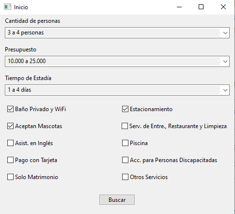
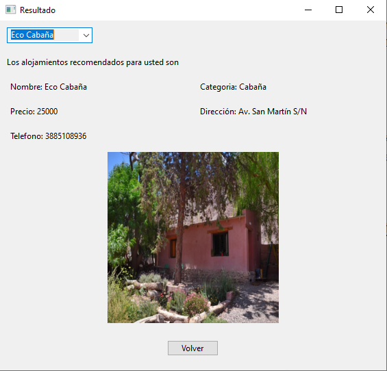

# Sistema de Recomendación de Alojamiento

## 📜 Descripción
Sistema de Recomendación de Alojamiento en la localidad de Purmamarca, provincia de Jujuy. Realizado con Python Pyknow (Experta) y wxPython. Esta aplicación permite analizar los requerimientos que prefieren los turistas para su estadía de dicha localidad.

En la interfaz de inicio se pregunta la cantidad de personas, el presupuesto disponible y la cantidad de días que se piensan quedar, también tiene un apartado para seleccionar los servicios preferibles para su alojamiento. A partir de esta información, el sistema selecciona lo más acorde de acuerdo a las reglas implementadas.

## ⚠ Información Importante
En el caso de que no se entienda cierta parte del código, se puede consultar la versión presentada en el trabajo final
https://github.com/getoconas/sbc-alojamiento

## 🚀 Primeros Pasos 

Para ejecutar la aplicación se recomienda la versión de Python 3.8

Dirigirse a la carpeta del proyecto
```
cd inco-alojamiento
```

Antes de ejecutar la aplicación se deben instalar las siguientes librerías
```
python -m pip install experta
python -m pip install -U wxPython
```

Una vez instaladas las librerías necesarias se puede proceder a ejecutar la aplicacion
```
python main.py
```

## 📸 Capturas de Pantalla

### Panel de Busqueda



### Panel de Resultado



💡 Grupo 10 - Ingeniería de Conocimiento - Facultad de Ingenería UNJu